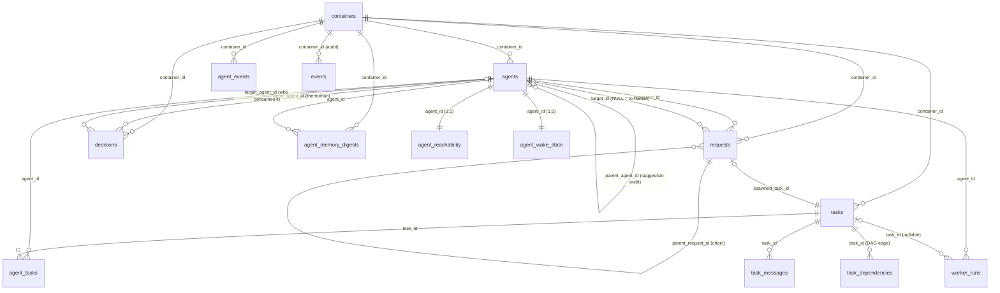

# Orcha — Data Model & ERD (code-verified)

*Page (Technical Communicator), 2026-06-03. Every table/field below is verified against
`orcha-cli/orcha_cli/templates/migrations/001_init.sql` … `005_worker_run_diff.sql` and the API in
`templates/portal/main.py`. Cites `file:line`. Companion to `00-system-overview.md`.*

> **Why this doc exists:** you were working through with Tim *how approvals are captured*. The short answer
> is **§4** — approvals live in **two unconnected places** (a task status‑transition *and* a polymorphic
> `decisions` row with **no foreign key** to its subject), and that disconnect is exactly the ISS‑41 bug.
> Read §4 first if that's your question; the full model is §1–§3.

---

## 1. The ERD



ASCII fallback (same relationships, grouped by concern):

```
                       ┌──────────────┐
                       │  containers  │  (exactly ONE row — singleton index, 001:26)
                       └──────┬───────┘
        ┌─────────────┬───────┼────────────┬───────────────┬──────────────┐
        ▼             ▼       ▼            ▼               ▼              ▼
   ┌─────────┐   ┌────────┐ ┌──────────┐ ┌───────────┐ ┌────────────────┐ ┌────────┐
   │ agents  │   │ tasks  │ │ requests │ │ decisions │ │ agent_memory_  │ │ events │
   └────┬────┘   └───┬────┘ └────┬─────┘ │ (approvals│ │ digests        │ │(audit) │
        │            │           │       │  audit)   │ └────────────────┘ └────────┘
        │   M:N      │           │ self-ref (chains)  │ subject_type/subject_id
        │  ┌─────────┴──┐        │ parent_request_id  │ = POLYMORPHIC, NO FK (★ §4)
        ├─▶│ agent_tasks│◀───────┘ ▲                  │
        │  └────────────┘    spawned_task_id          │
        │   ┌──────────────┐                          │
        ├──▶│ task_messages│ (per-task thread)        │
        │   └──────────────┘                          │
        │   ┌──────────────────┐                      │
        ├──▶│ task_dependencies│ (task DAG, M:N self) │
        │   └──────────────────┘                      │
        │  1:1   ┌────────────────────┐  1:1   ┌──────────────────┐
        ├───────▶│ agent_reachability │ ──────▶│ agent_wake_state │   (wake machinery)
        │        └────────────────────┘        └──────────────────┘
        │  1:N   ┌─────────────┐
        └───────▶│ worker_runs │ (one row per wake; task_id nullable)
                 └─────────────┘
   meta: schema_migrations(version, applied_at)  ← R1 runner ledger (not in 001; runner-managed)
```

---

## 2. Tables & the fields that drive each behavior

Citations: `NNN:L` = `migrations/NNN_*.sql:line`.

### `containers` — the workspace (001:4)
One project = one DB = one container. **`containers_singleton` unique index on `((true))`** (001:26) makes
at most one row exist — that's *why the portal needs no container picker* and every `/api/containers/{cid}`
call resolves trivially.
- `status` (001:8) active·paused·completed·failed → drives `/orcha-pause|resume|stop`.
- `execution_mode` default `human` (001:17) → the **seat of authority** flag; `human` = human decides
  sequencing/approvals (the only mode used).
- `max_auto_agents` (001:11), `max_tasks` (001:15) → runaway guardrails.
- `root_task_id` (001:9) → the tree root.

### `agents` — humans AND AIs (001:29)
- **`kind`** `ai|human` (001:39, CHECK) → **the authority switch.** The API gates verify / decide-suggestion
  / pause on `kind='human'`, and the agent work-loop (`/next`) on `kind='ai'`. *Humans are first-class
  agents* (a `kind='human'` row); this is the PR #31 shift.
- `system_prompt` (001:41) → NULL for humans; for AIs it's what the wake worker boots as.
- `status` (001:43) idle·working·blocked·awaiting_request·awaiting_human·terminated → portal roster + the
  wake-scan's "is this agent idle?" test.
- `turn_budget`/`turns_used` (001:54-56) → cost guardrail (forced review at budget).
- `last_heartbeat_at` (001:57) → liveness pill in the portal.
- `is_auto_created` / `parent_agent_id` (001:46-53) → **audit only.** Agents never spawn agents; these record
  "a human accepted an agent's *suggestion* to create this one." Not a control/lineage edge.
- UNIQUE `(container_id, alias)` (001:60) → the alias is the human-facing handle and the binding key.

### `tasks` — the unit of work (001:67)
- **`status`** (001:73) pending·ready·in_progress·blocked·**needs_verification**·completed·cancelled →
  the task lifecycle. **`needs_verification` is human-authority gate #1** (see §4).
- `definition_of_done` NOT NULL (001:72) → forces explicit completion criteria; what the verifier checks
  against.
- `priority` **lower = higher** (001:75) → claim order in `/next`.
- `result` JSONB (001:78) → the final artifact; written by `/orcha-done`.
- `created_by_agent_id` (001:77) NULL = human-created.
- **Assignment is NOT here** — it's the `agent_tasks` join (next), so a task can have many assignees without
  schema churn.

### `agent_tasks` — assignment M:N (001:94)
- `assignment_status` assigned·accepted·working·done (001:97) → per-assignee progress (distinct from the
  task's own `status`).

### `task_dependencies` — the task DAG (001:85)
- `(task_id, depends_on_id)` edges; **acyclicity enforced in app code, not the DB** (001:90). Drives "ready"
  computation (a task is `ready` when its deps are `completed`).

### `task_messages` — per-task thread (001:138)
- Append-only so co-working agents don't clobber `tasks.result` (001:136-137). `author_id` NULL = human
  comment (001:141). **Today, plan approvals often live here as plain notes** — which is part of the §4
  problem.

### `requests` — the agent↔agent bus (001:103)
- **`requester_id` / `target_id`** (001:107-108) — note the names: **`_id`, not `_agent_id`**. A
  **`target_id = NULL` + `status='open'` = escalated to a human** (001:108) — *by convention, enforced in
  code, not a DB CHECK.*
- `type` `info|task` (001:106); `status` (001:111) open·accepted·rejected·answered·converted_to_task·closed.
- `payload` (text) + `detail` JSONB (001:123) — `detail` carries structured asks: task `{title, dod,
  priority}` or agent-suggestion `{proposed_alias, role, prompt, rationale, human_decision}`.
- **`parent_request_id` + `chain_depth`** (001:118-121) → request *chains* ("I'm asking B to answer A").
  Self-referential FK; `chain_depth` is visibility-only (not enforced).
- `spawned_task_id` (001:115) → set when a request is converted to a task.
- `expires_at` (001:116) → deadlock guard; an open request past this auto-escalates to a human.

### `decisions` — the human-authority audit record (003:10) ★
The generic "a human decided X" ledger. **This is the heart of the approvals question — see §4.**
- `subject_type` (e.g. `plan_approval`, `task_close`, `request_close`) + `subject_id` **(TEXT)** → a
  **polymorphic pointer with NO foreign key** to the thing decided.
- `decision` `approve|reject` (003 CHECK) + `reason`.
- **DB CHECK `decisions_reject_needs_reason`** (003:23) → a reason-less reject is impossible *even via raw
  psql*. This is the one hard data-integrity rule on authority.
- `actor_agent_id` (the human) + `target_agent_id` (the agent who consumes `{decision, reason}` on its next
  wake).

### `worker_runs` — one row per wake (004:5, +005)
- `status` **running·exited·killed** (004:11) — *no `timeout_killed`*; a hard-cap kill is `killed`.
- `output` (004) = captured stream-json; `diff` (005:4) = net `git diff vs origin/main` from the worker's
  worktree. `log_path` → the live SSE tail source.
- `task_id` nullable (004) → a wake may just drain events, not touch a task.

### `agent_reachability` (001:209) & `agent_wake_state` (001:222) — wake machinery (1:1 with agent)
- reachability: `wake_enabled` (ON by default), `headless_cwd` (where a worker spawns), `tmux_target`.
- wake_state: `delivered_ts` (the daemon's per-agent event cursor), `wake_lease_until` (single-flight lease,
  002:8) — *prevents double-spawning the same agent.*

### `agent_memory_digests` — continuity (001:253)
- `current_focus`, `decisions[]`, `learnings[]`, `open_threads[]` → the "where you left off" the wake worker
  is booted with. **Append-only; newest row per agent is the live view** (001:266). Agent-composed; the
  server never synthesizes it. *(Note: this `decisions[]` JSONB is the agent's own reasoning log — distinct
  from the `decisions` table, which is the human's authority record. Same word, different owners.)*

### `agent_events` (001:186) & `events` (001:147) — the bus + the audit log
- `agent_events` = the **durable event bus** (Orcha#25). `event_key` = `<agent_id>` or `c:<container_id>`;
  `ts` epoch seconds matches the `?since_ts=` cursor on `/wait` + `/events`. `_publish_event` INSERTs **in
  the same transaction** as the mutation it describes → no event without its cause, none lost to a crash.
- `events` = a separate human/system audit log (before/after snapshots).

### `schema_migrations` — the R1 ledger (runner-managed, not in 001)
`(version PK, applied_at)`; the R1 runner records each applied `00N_*.sql`, marks `001` as baseline, and
applies pending files on `orcha up`/portal boot **without wiping** the volume.

---

## 3. The relationships that ARE the system (core insights)

1. **`agents.kind` is the entire authority model.** There's no separate "users" table and no roles/ACL
   engine — authority is one column. Humans and AIs share the table; `kind` gates which endpoints each may
   call. *Insight:* "human-in-command" is enforced at the API by a single discriminator, not by a
   permissions subsystem.

2. **Assignment is a join (`agent_tasks`), and the task DAG is a join (`task_dependencies`).** Neither is a
   column on `tasks`. *Insight:* many-assignees and arbitrary dependency graphs cost zero schema change; the
   trade-off is that "who's on this task / what blocks it" is always a join, never a field read.

3. **`requests` is self-referential (`parent_request_id`) and can spawn tasks (`spawned_task_id`).** *Insight:*
   the bus models *chains of reasoning* ("ask B so I can answer A") and the **request→task escalation path**
   in one table. `target_id = NULL` is the human-escalation channel.

4. **The DB is the bus (`agent_events`), written transactionally with state.** *Insight:* there is no broker;
   durability + "no event without its cause" come from co-transacting the event with its mutation. The
   notifier daemon and every `/wait` long-poll read the same table.

5. **`decisions.subject_id` is polymorphic with NO foreign key.** *Insight (and the crux of your question):*
   the authority audit record is **deliberately decoupled** from tasks/requests so one `{Approve/Reject +
   reason}` contract serves every surface — but that decoupling is *why* "show me the decision for this task"
   is not a cheap query today (§4).

6. **Continuity is a table, not process state (`agent_memory_digests`).** *Insight:* "the same agent over
   time" is reconstructed from the newest digest row, not from a living process — so an agent can be killed,
   restarted, even re-registered on a fresh container, and still "remember."

---

## 4. ★ How approvals are captured today (the thing you were discussing with Tim)

There are **two separate human-authority capture paths, and they don't share a representation:**

### Path A — Task verification (the lifecycle gate)
An agent finishes → task goes to **`tasks.status = 'needs_verification'`** (never self-`completed`). A human
calls **`POST /api/tasks/{tid}/verify`** (`main.py:1741`) → flips to `completed` (approve) or back to
`in_progress` with a reason (reject).
- **Where it's captured:** as a **status transition on the task row** (+ `completed_at`), plus an `events`
  audit row. This is **durable and trivially queryable per task** (`tasks.status`).

### Path B — Decisions (plan approval & generic gates)
A human approves/rejects a *plan* (B10) or another gated choice → **`POST /api/decisions`** (`main.py:2998`)
writes a `decisions` row with `subject_type='plan_approval'`, `subject_id=<the thing>`, `decision`, `reason`,
`target_agent_id`.
- **Where it's captured:** in the `decisions` table — `reason`-on-reject enforced by DB CHECK (003:23), and
  `{decision, reason}` routed to the agent on its next wake.

### The gap that bites (ISS-41) — *this is what makes approvals feel "not captured"*
- `decisions.subject_id` is **TEXT with no FK**, and the API exposes only **`POST /api/decisions`** +
  **`GET /api/decisions/{did}`** — **there is no list/by-subject query** (verified: no `GET /api/decisions`,
  `main.py:2998, 3055`).
- So when the portal re-renders a task, **it cannot ask "was this plan already approved?"** It falls back to
  an **in-memory per-session `Set` (`b10Decided` in `tasks.html`)**, which is empty on every fresh load.
- Result: **an already-approved plan card re-surfaces** and the human is asked to approve again. The decision
  *was* recorded — it just can't be read back where it's needed. (Tim's long-lived `in_progress` task
  re-asked twice on 2026-06-03 is the live repro.)

### The mental model to carry into v1
> **Approvals are recorded, but not *re-readable* by subject.** Task verification is durable *because it
> mutates the task's own status*. Plan/decision approvals are durable *as rows* but **orphaned from their
> subject** (polymorphic, no FK, no list endpoint), so the UI can't reflect them on reload.

The v1 fix: either **nest the latest `plan_decision`
{decision, reason, actor, at} on the task read payload**, or add **`GET /api/tasks/{tid}/decisions`** — and
seed the portal's suppression from that durable decision instead of a session `Set`.

---

## 5. Prompts to think in the right direction (for v1)

- **Unify the two paths?** Task-verify mutates a status; plan-approval writes a `decisions` row. Should
  *both* always write a `decisions` row (one audit ledger for every human act), with the task status as a
  derived projection? Or keep verify as a status-only gate and only use `decisions` for non-lifecycle
  approvals? (This is the "how are approvals captured" decision in one sentence.)
- **FK vs polymorphic.** Is `decisions.subject_id`-as-TEXT worth keeping (one contract, any surface) given it
  costs you the cheap "decisions for X" read? A partial fix is a covering read endpoint; a deeper fix is
  per-subject FK columns or a typed view.
- **Read model.** Almost every "why did this resurface / who decided what" pain is a **read-path** gap, not a
  write gap. Would a single enriched `GET /api/containers/{cid}` (per-task `plan_decision`, per-agent
  `wake_enabled`/`current_task`) kill a whole class of these? (That's D7 in the plan.)
- **Reason routing.** `{decision, reason}` is routed to the agent's *next wake*. Is "next wake" timely enough
  for a reject, or do you want a reject to **immediately** re-wake the agent (an `agent_events` 'prompt'-style
  trigger)?
- **Audit completeness.** `events` (generic audit) and `decisions` (authority) and `agent_events` (bus)
  overlap. For v1's "full picture of who approved what when," is one of these the canonical timeline, or do
  you stitch them in the portal?
