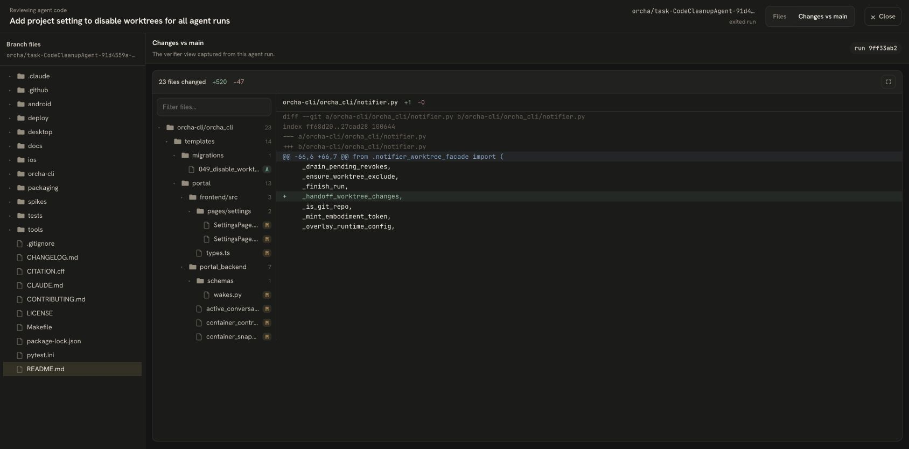
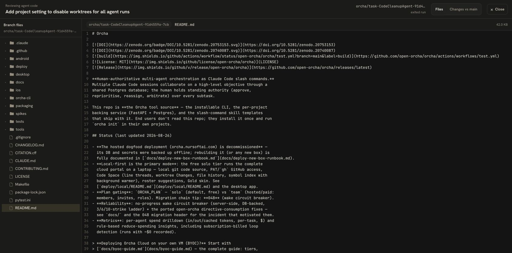

# Task Code Space

Issue: [#249](https://github.com/open-orcha/orcha/issues/249)

## Purpose

Task Code Space gives a verifier one quiet place to read an agent's branch and
review its captured changes before accepting the task. It is a read-only mode
of the existing Code Space rather than a second code browser.

The task page and task-backed run cards on both the task and agent pages now
expose **Open code space**. The task action selects the latest run with code
context; a run action opens that exact run. Both land on `/code` with stable
`task` and optional `run` parameters.

## Layout

The ordinary portal shell is deliberately absent in task mode. The whole
viewport contains:

1. A compact review ribbon with the task title, source branch, Files/Changes
   switch, and one Close action.
2. The agent branch's file tree on the left.
3. Either a syntax-highlighted, read-only file or the run's captured unified
   diff against `origin/main` on the right.

This keeps the branch and verifier diff visible in the same spatial model while
removing task lists, portal navigation, editing, terminals, and discussion
tools from the review moment.

### Changes vs main

### Branch file viewer

The screenshots use an existing completed task/run so the diff view has
representative data. The layout and behavior are the same for issue #249.

## Data source and honesty

`GET /api/tasks/{task_id}/runs` is the association source of truth. It already
returns each run's branch, worktree metadata, status, and captured net diff.
Task Code Space uses:

- the selected run's `branch` with the existing repository browse endpoints
  for the tree and file contents;
- the selected run's captured `diff` for **Changes vs main**.

This works with both existing code sources: local projects resolve the branch
through the mounted repository; GitHub-bound projects resolve it through the
current GitHub browse API. No host filesystem path is sent to the browser.

For a run that is still active, the branch remains browsable but the captured
diff may be empty until the worker finishes and records its net change. The UI
says “No net change” instead of inventing a result. An unavailable run feed or
a task with no run gets a directed empty state.

## Return and desktop behavior

Opening Task Code Space stores the originating task or agent-run URL and scroll
position in tab-scoped session storage. Close or Escape returns to that page and
restores the reading position. If storage is unavailable or belongs to a
different task, the stable task deep link is the fallback.

In the desktop app, navigation to `/code?task=…` makes the embedded portal view
cover the native project bar as well. Leaving the route restores the bar. The
main `BrowserWindow` explicitly remains `fullscreenable`, so the macOS green
button and `Ctrl+Cmd+F` use true native full screen.

## Scope

- Read-only: no editor, terminal, commit, or push controls.
- Desktop and full-size web layouts are supported.
- Mobile is intentionally out of scope. Below the minimum review viewport,
  the page directs the user to desktop/web rather than presenting a cramped or
  misleading code review.
- The Files/Changes controls and Close action are keyboard focusable; Escape
  closes the surface unless the diff's own expanded overlay is open, in which
  case the first Escape closes that overlay.
